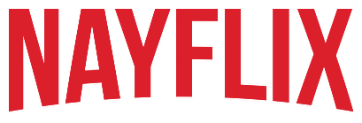

<h1 align="center">   </img> </h1>

  
  <a href="#-projeto">Projeto</a>&nbsp;&nbsp;&nbsp;|&nbsp;&nbsp;&nbsp;
  <a href="#-tecnologias-utilizadas">Tecnologias utilizadas</a>&nbsp;&nbsp;&nbsp;|&nbsp;&nbsp;&nbsp;
  <a href="#%EF%B8%8F-executando-a-aplicação">Executando a aplicação</a>&nbsp;&nbsp;&nbsp;|&nbsp;&nbsp;&nbsp;
  <a href="#%EF%B8%8F-contribuidores">Contribuidores</a>&nbsp;&nbsp;&nbsp;|&nbsp;&nbsp;&nbsp;
  <a href="#-licença">Licença</a>

## 💻 Projeto

Recriado a interface do principal site de streaming mundial utilizando tecnologias simples como HTML5, CSS3 e JavaScript. 

## ✅ Tecnologias utilizadas

- [JavaScript](https://www.javascript.com/)
- [HTML5](https://www.w3c.br/pub/Cursos/CursoHTML5/html5-web.pdf)
- [CSS](https://www.w3schools.com/css/)
- [Jquery](https://jquery.com/)

## ▶️ Executando a aplicação

- Clone o repositório para a sua máquina

  git clone https://github.com/nayallalima/Netflix-Clone-DIO.git

## ♥️ Contribuidores 

 Obrigada a todos que fazem parte da <a href="https://digitalinnovation.one/">DIO. </a> 

## 🔒 Licença

---

  Feito com 💜️ por <a href="https://github.com/nayallalima">Nayalla Lima </a>

